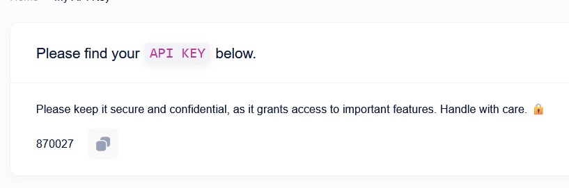

## **About**
SkyPay is a comprehensive payment gateway solution in Nepal by SkyBase Innovations. It simplifies integration, boosts developer productivity, reduces costs, and minimizes technical challenges. With options like Manual Entry, Merchant API, and SkyPay Managed, it streamlines online payments and is especially beneficial for developers. It also supports various payment methods, including Khalti, eliminating the need to integrate with individual banks.

## **Pre-requisites**
1. Create your **FREE MERCHANT ACCOUNT** here: [Merchant Registration Page](https://pay.skybase.com.np/register)
2. Download & set up the **Merchant App** from the link available your Dashboard
3. Copy your **Access Key / API Key** Key provided on your dashboard page

## **Getting Started**

###  Import SkyPay Sdk package: 
To begin using the Skypay SDK, you need to import the package into your Flutter project. Add the following import statement at the top of your Dart file where you intend to use Skypay:

```dart
import 'package:skypay_sdk/skypay_sdk.dart';
```

### Create a Navigator Key for SDK Navigation
The navigator key you create will facilitate navigation specific to the Skypay SDK package within your Flutter application. In your main.dart file, create a navigatorKey as demonstrated in the code below:
```dart
class SkyPayDemoApp extends StatefulWidget {
    final GlobalKey<NavigatorState> navigatorKey = GlobalKey<NavigatorState>();
    SkyPayDemoApp({super.key});
}
```
###  Pass the SDK Navigator Key to Your MaterialApp
Integrate the navigatorKey you've created for the SDK into your MaterialApp. This allows you to control navigation specific to the Skypay SDK package throughout your application. Update your MaterialApp as follows:
```dart
return MaterialApp(
      navigatorKey: widget.navigatorKey,
    );
```
### Retrieve Your API Key from Skypay Dashboard
Navigate to your [Skypay dashboard](https://pay.skybase.com.np/dashboard) and copy the API Key from the ```'My API Key'``` section.
</br></br>

### Initialize SkyPay Configuration
To set up SkyPay correctly, you should include this code at the beginning of your app. Specifically, place it in the initState method within the main Dart file (main.dart) or the main entry point of your Flutter application.
```dart
    @override
  void initState() {

    // Provide the navigatorKey (replace 'YOUR_NAVIGATOR_KEY' with your actual navigatorKey)

    Skypay.initConfig(
        navigatorKey: 'YOUR_NAVIGATOR_KEY', 
        apiKey: 'YOUR_API_KEY_HERE',
        );
    super.initState();
  }
```
Replace ```'YOUR_API_KEY_HERE'```: Make sure to replace ```"YOUR_API_KEY_HERE"``` with your actual SkyPay API key. You obtained from your SkyPay dashboard.

### Initialize Payment

To initiate a payment, use this code snippet with Skypay. 

```dart
Skypay.initPayment(
    orderId: "Your_UNIQUE_Order_ID",
    amount: "Amount In Rupees",
    onSuccess: (data) {
        //On Success Event
    },
    onFailure: (data) {
        //On Fail Event
    },
    onCancellation: () {
        //On Cancell Event
    },
);
```

Replace `"Your_UNIQUE_Order_ID"` with your unique order identifier.

Replace `"Amount In Rupees"`: Set the transaction amount in Rupees as needed.

### Parameters

| Parameter | Required | Description |  
| --- | --- | --- |
| amount | true | The transaction amount. |  |
| success_url | false | URL to be redirected when payment successful |  |
| failure_url | false | URL to be redirected when payment fails |  |
| order_id | true | Unique identifier for the order (same order_id is available for 10 minutes) |  |

### **Callbacks**
In the SkyPay Payment Gateway integration, you can utilize callback functions to handle different transaction outcomes. These callbacks are essential for managing various scenarios, such as successful transactions, failed transactions, and user-initiated cancellations.

#### **onSuccess Callabck :** 
- The `onSuccess` callback is designed to handle actions that occur when a transaction is successfully completed. This function will be invoked when a transaction is successful, allowing you to perform specific tasks or actions associated with a successful transaction.

#### **onFailure Callabck :** 
- The `onFailure` callback comes into play when a transaction encounters issues and fails to complete. This callback function is responsible for managing failed transactions, and it provides you with the ability to handle error cases, log details, or take appropriate actions.

#### **onCancel Callabck :**
- The `onCancel` callback is triggered when a user decides to cancel a payment transaction before its completion. This callback function allows you to manage the cancellation event, which can include actions like returning the user to a specific screen or providing a cancellation confirmation.

These callback functions are essential for ensuring a seamless and user-friendly payment experience in your application. You can customize each callback to fit your specific requirements and user interactions.

## Conclusion

In this guide, we've covered the essential steps to get started with Skypay SDK integration. You've learned how to initialize the configuration, set up navigation, and utilize callback functions for handling transaction outcomes.

We hope this documentation has been helpful in seamlessly integrating the Skypay SDK into your Flutter application.

For more detailed information about Skypay initialization, please refer to the [Skypay documentation](http://docs.pay.skybase.com.np/).

